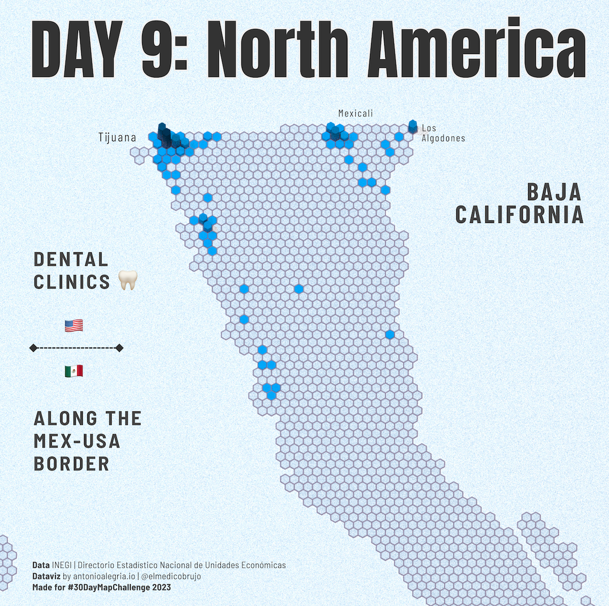
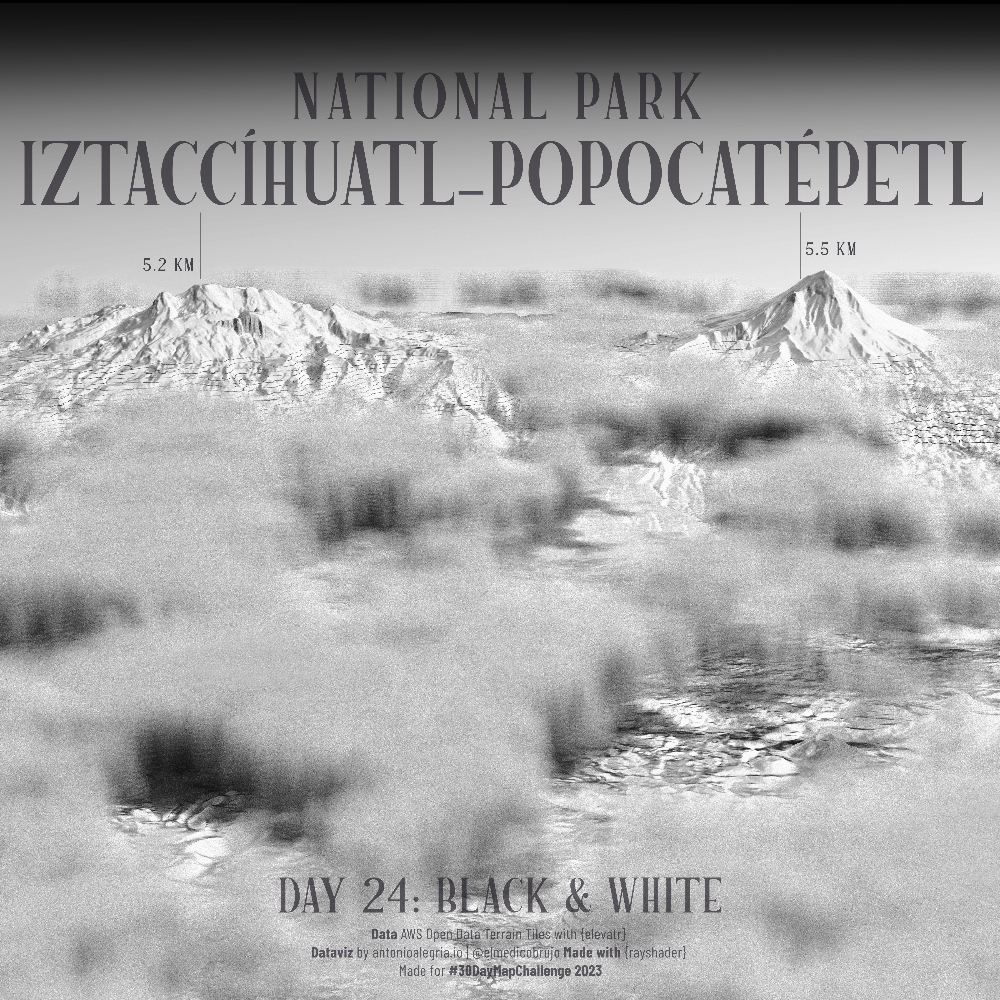

## 30 Days of Maps?

>The idea is to create maps based around different themes each day of November using the hashtag #30DayMapChallenge. You can prepare the maps beforehand, but the main idea is to publish maps on the dedicated days. Just include a picture of the map when you post to Twitter (or other platforms) with the hashtag. You don't have to sign up anywhere to participate. There are no restrictions on the tools, technologies or the data you use in your maps. Doing less than 30 is also fine. See the Code of Conduct.
 

## Yes! 30 Days of Maps!

 

You can find the code on my [github](https://bit.ly/3Us4COu). 

## Day 1: Points

Mapping 32K free wireless access points in Mexico City. They are part of 17 public programs distributed in places like public transport, medical centers, schools and universities. 

Source: [CDMX Datos Abiertos](https://datos.cdmx.gob.mx/dataset/puntos-de-acceso-wifi-en-la-ciudad-de-mexico)

 

 

## Day 2: Lines

Mapping the ridership on the Glasgow Subway line. Unfortunately, there's not much information or data easily available on the ridership of the system. I could only find some annual reports from 2015 and a 2019 Freedom of Information Act request from Patrick Murphy.

Source: [Freedom Of Information Act](https://www.whatdotheyknow.com/request/request_for_some_usage_statistic_7#incoming-1291508) and of course Open Street Maps

 

 

## Day 3: Polygons

How many trees are there in Buenos Aires Ciudad? More than 300,000! All of this data was made possible by: [Buenos Aires Data: Arbolado 2017-2018](https://data.buenosaires.gob.ar/dataset/arbolado-publico-lineal/resource/51668e94-12af-401f-aba5-84476f78bb9d)

I feel like I'm going to return to this analysis in the near future. There's so much data and so many variables that I cannot resist.
 

 

## Day 8: Africa

Did you see the final_final_episode.mov of Attack on Titan? Have you ever wondered what the walls would look like if they were real?

Well, according to information provided in both the anime and the manga, it's believed that Paradis Island is located on the real island of Madagascar. With that in mind, I've compiled all the data provided by Hajime Isayama to create this.

 

 

## Day 10: North America

I just realized that I put the wrong day in the map title. Oops. For now, it will stay this way.

Data [INEGI](https://www.inegi.org.mx/)

This is a really curious case of the failure of the United States dental healthcare system but a really good business for the dental economy in Mexico.

Los Algodones is a relatively small town that has at least 600 clinics!

## Day 17: Flow

This is such an amazing dataset. I could barely scratch the surface. Honestly, this deserves a future in-depth analysis.

Note: The population density estimates seem a little bit off. But if you read the methodology, it makes some sense. Again, those numbers are just estimates.

Source: [Data for good at Meta](https://facebookincubator.github.io/CommutingZones/docs/intro/)

## Day 24: Black and White

Last week in Mexico City, we bore witness to some of the clearest views of the year of two of the highest peaks in the country: the active Popocatépetl and the snow-capped Iztaccihuatl. This is usually the result of lower temperatures caused by a cold front and rapid winds. 

I attempted to recreate some of the uncanny views using the rayshader machine. However, you can also Google some real-life images for comparison.

Source: [AWS Open Data Terrain Tiles with {elevatr}](https://registry.opendata.aws/terrain-tiles/)

