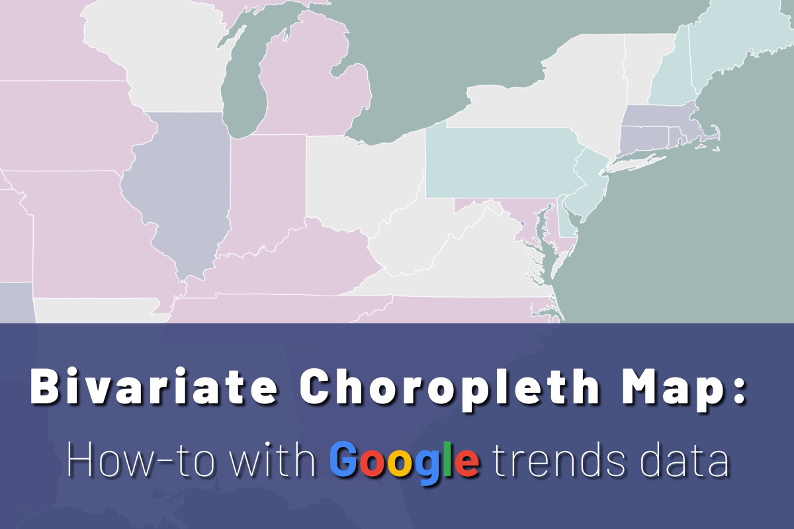
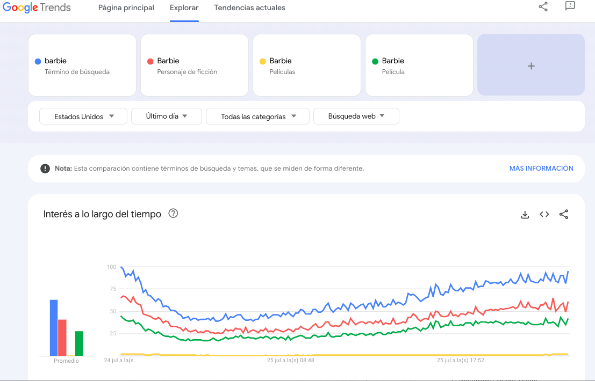
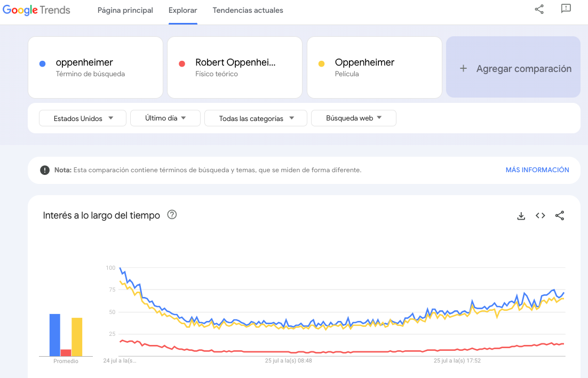
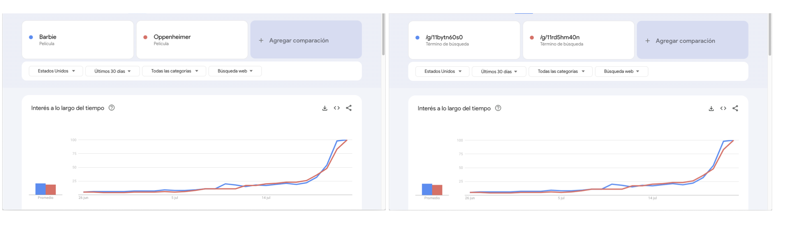
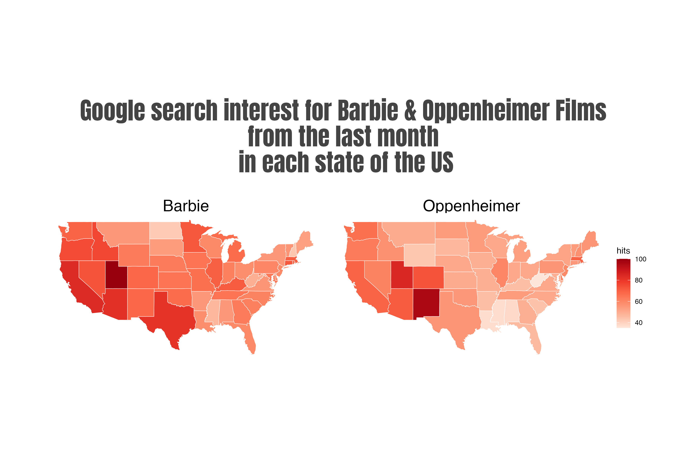
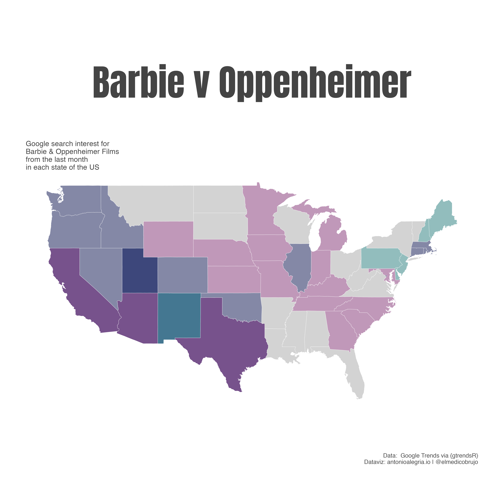
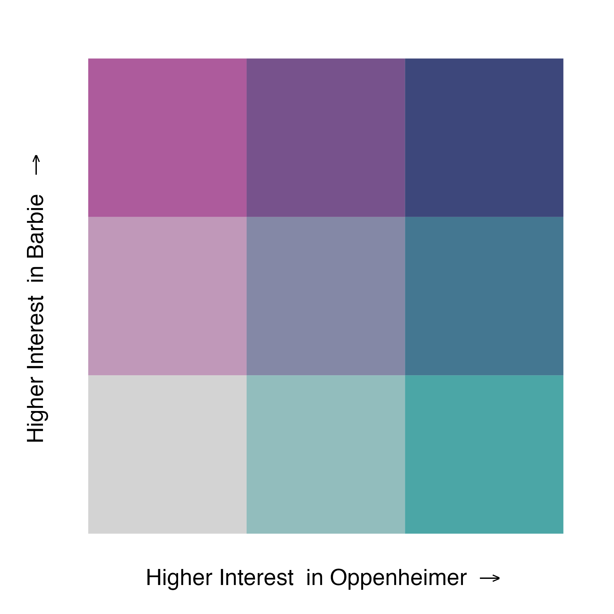
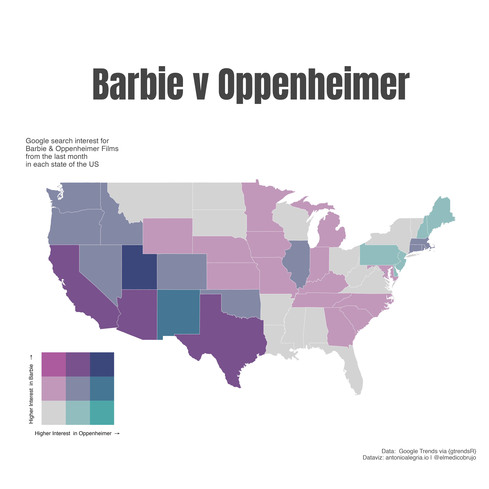

## Bivariate map turorial: How-to with Google trends data


<br>

## Bivariate map turorial 

Alright, let's dive in! I'll show you how to create a bivariate map in R using Google Trends data. No worries, I won't make it complicated.

This tutorial covers the following steps:


1. What a bivariate choropleth map is all about?
    - 1.1 Advantages vs disadvantages
2. Getting the Data: Where and how to fetch it.
    - 2.1  Using `{gtrendsR}` to get the data you need. 
    - 2.2  Finding the correct ID from the Google Knowledge Graph
    - 2.3  It's time to use `{gtrendsR}` and gather the data.
    - 2.4  Getting the Necessary Map Data
    - 2.5  Joining datasets
3. Make sense of the data with the `{biscale}` package
4. Mapping: Putting It All Together
5. Final Thoughts 

<br>

## 1- What is a bivariate choropleth map?  

A bivariate choropleth map is a map that combines two different sets of data. It's like having two stories told on the same map! This helps us see if there's any connection or pattern between the two datasets.

This type of map uses colors, patterns, symbols, or shading to display the similarities or differences between the two variables. It's a great way to visualize and compare two different geographic datasets within a specific geographical area.

<br>

## 1.1- Advantages vs disadvantages

Using a bivariate map has its perks. You can quickly spot relationships and trends that might not be apparent in separate maps. However, it's essential to be cautious because having too much information on one map can get confusing.

Advantages:

- Gain deeper insights.
- Understand spatial context better.
- Communicate effectively.
- Facilitate comparative analysis.
- Identify outliers.

Potential drawbacks:

- Risk of misinterpretation.
- Visual complexity.
- Data overload.
- Limitations with multiple variables.
- Possibility of spatial bias.

Using bivariate maps requires careful design and consideration of the data and audience to ensure accurate and meaningful representation.

If you're planning to delve deeper into the subject, I highly recommend checking out JUDY M. OLSON's (1981) work on[SPECTRALLY ENCODED TWO-VARIABLE MAPS](https://www.jstor.org/stable/2562796). It could provide valuable insights.

<br>

## 2- Getting the Data: Where and how to fetch it

Getting the data is simple! To begin, you'll need data from Google Trends, a useful tool that reveals the popularity of search terms over time.

How-to?

Use the `{gtrendsR}` package: It's a great tool that helps you access Google Trends data easily. With just a few simple lines of code, you can get the data and make it reproducible.

Leverage `{rnaturalearth}` package: This data package provides map data that can be visualized using other R packages. It complements your bivariate map creation by providing the necessary geographical context.

With these two packages, you'll have all the data you need to create an impressive bivariate map.

<br>

## 2.1- Using {gtrendsR} to get the data you need

To fetch the data we need from Google Trends, we use `{gtrendsR}` package. But, before we dive in, let's understand what a **Topic search** is and why it's important to differentiate it from a regular search.

**Topic search** is crucial because it helps us get more relevant and comprehensive results. Let's take an example:

For the upcoming Barbie movie's interest data, the results can vary depending on the **Topic search** used. Here's the link to the Google Trends search for Barbie -> [Google Trends Search: Barbie](https://trends.google.com/trends/explore?date=now%201-d&geo=US&q=barbie,%2Fm%2F015w6q,%2Fm%2F0479tck,%2Fg%2F11bytn60s0&hl=es-419)


The results for Barbie are categorized into different topics like **"Search Term"**, **"Fiction Character"**, **"Movies"**, & **"Film"**. Each topic gives specific insights that contribute to a more comprehensive understanding of the Barbie movie's interest data.

<br>



<br>

The search for Oppenheimer provides different topics: [Google Trends Search: Oppenheimer](https://trends.google.com/trends/explore?date=now%201-d&geo=US&q=oppenheimer,%2Fm%2F09qxy,%2Fg%2F11rd5hm40n&hl=es-419)

The results are divided in: **"Search Term"**, **"Physics"**, **"Movie"**

<br>



<br>

Before searching for a specific phrase or word as a topic, it's essential to find the query term that represents the **Topic search** you're interested in. This helps ensure that you're gathering relevant and focused data for your analysis.

Now, let me introduce you to the concept of the [**Google Knowlege Graph ID**](https://blog.google/products/search/introducing-knowledge-graph-things-not/)

> What is that? The Knowledge Graph enables you to search for things, people or places that Google knows about—landmarks, celebrities, cities, sports teams, buildings, geographical features, movies, celestial objects, works of art and more—and instantly get information that’s relevant to your query. 
 
> Google’s Knowledge Graph isn’t just rooted in public sources such as Freebase, Wikipedia and the CIA World Factbook. It’s also augmented at a much larger scale—because we’re focused on comprehensive breadth and depth. It currently contains more than 500 million objects, as well as more than 3.5 billion facts about and relationships between these different objects. And it’s tuned based on what people search for, and what we find out on the web.

<br>

## 2.2- Finding the correct ID from the Google Knowledge Graph

No worries, it's an easy process!

Here's a simple way to find the correct Google Knowledge Graph ID for your topic:

1. Go to [wikidata.org](https://www.wikidata.org/wiki/Wikidata:Main_Page.
2. Perform the same search you made on the Google Trends site.
3. Once you find your topic on Wikidata, scroll down or use `cmd+f` to search for **"Google Knowledge Graph ID"**.
4. Copy the code associated with your topic and save it in your script.

For example, let's consider the topic "Barbie" as an example: [Barbie on Wikidata](https://www.wikidata.org/wiki/Q55436290#P2671). The Google Knowledge Graph ID for the upcoming **Barbie Film** is **/g/11bytn60s0**. With this code, we can now extract the data accurately.

As you can see, using the Google Knowledge Graph ID ensures that you get the exact topic search you need to fetch precise data from Google Trends. It's a straightforward and reliable way to make sure you're working with the right information.

<br>



<br>

For quick reference:

- **Barbie Film**: /g/11bytn60s0
- **Oppenheimer Film**: /g/11rd5hm40n

Now that we have the IDs, we can use them to explore the interest data for both films in Google Trends. Feel free to check it out yourself using the following link: [Barbie & Oppenheimer Films](https://trends.google.com/trends/explore?date=today%201-m&geo=US&q=%2Fg%2F11bytn60s0,%2Fg%2F11rd5hm40n&hl=es-419)

With this data, you're all set to create insightful bivariate maps and uncover any interesting patterns or trends between these two films.

<br>

## 2.3- It's time to use {gtrendsR} and gather the data.


Awesome! Now that we have the Google Knowledge Graph IDs for the **Barbie** Film and the **Oppenheimer** Film, we can use the `{gtrendsR}` package to retrieve the Google Trends data we need.

> `{gtrendsR}` provides an interface for retrieving and displaying Google Trends information.
> Trends (number of hits) over time as well as geographic representation of the results can be displayed.

If you want to explore more about the package and its usage, check out the `{gtrendsR}` GitHub page: [`{gtrendsR}` github page](https://github.com/PMassicotte/gtrendsR). Also, for detailed information, you can refer to the full documentation here: [gtrendsR Reference Manual.](https://cran.r-project.org/web/packages/gtrendsR/gtrendsR.pdf).


Let's dive into the main function to get the data:

```{r, eval=FALSE}

gtrends(keyword = NA,
        geo = "",
        time = "today+5-y")

```

In the `keyword` argument, use the Google Knowledge Graph IDs for **Barbie Film** and **Oppenheimer Film** respectively.

The `geo` argument requires a two-digit country code to specify the region of interest. You can find the country codes using the `countries()` function.

For the `time` argument, you can specify the time span of the query. Check the documentation for more details on the time format.

With this simple code, you can fetch the Google Trends data for both films and start your analysis.

----------------------------------------

Once the necessary information is completed, the function will provide us with a `list()` of data frames. In my example, I'm using the Google Knowledge Graph IDs as they are, to demonstrate that it will retrieve the same data. However, you can easily transform them into a vector for a cleaner and more organized code.

- **Barbie Film**: /g/11bytn60s0

- **Oppenheimer Film**: /g/11rd5hm40n

```{r,eval=FALSE}

search_query_by_id <- gtrendsR::gtrends(keyword = c("/g/11bytn60s0", 
                                                    "/g/11rd5hm40n"),
                                        time = "today 1-m",
                                        geo ="US" )

```

**Important Note**: If you encounter the error message `Status code was not 200. Returned status code:429`, I'm sorry to inform you that there's no quick fix for this issue. The main reason behind it is that Google Trends doesn't provide a proper API access, and sometimes, it temporarily blocks data retrieval.

My personal recommendation is to give it a few more tries, usually attempting two or three times works for me. If you're still facing the error, I suggest waiting for a couple of hours and then trying again.

Now, if you find yourself repeatedly exploring the same data, here's a handy tip to avoid making the same requests multiple times. You can save the data as an .rds object using the following code:

<br>

`saveRDS(search_query_by_id, "query_brb_opp_30days_US_20jul.rds")`

<br>

This way, you can load the data directly from the saved .rds object in your future analyses, saving both time and effort.

<br>

## 2.4  Getting the Necessary Map Data

Now, let's get the map data we need. It's a straightforward step:

Since we're retrieving US trends data, we can use the `{maps}` package to get the states' polygons
.
The `st_as_sf()` function from the `{sf}` package will be useful for joining both datasets.

```{r, eval=FALSE}

states <- sf::st_as_sf(maps::map("state", plot = FALSE, fill = TRUE)) %>% 
  rename("region" = ID)

```

**Note**: For a wider extraction of different regions around the world, I highly recommend checking out the `{rnaturalearth}` package. It provides an extensive selection of map data for various regions, making it a valuable resource for your mapping projects.

With the states data ready, you can now combine it with the Google Trends data and create your bivariate map. 

<br>

## 2.5 Joining Datasets

To join datasets, we need at least one variable with the same name.

If you recall, earlier we used `rename("region" = ID)` on the states map. Now, let's do the same for the `search_query_by_id` Google Trends dataset.

```{r, eval=FALSE}

BvO_InterestByRegion <- as_tibble(search_query_by_id$interest_by_region) %>% # Extract the interest by region from the list 
  dplyr::mutate(region = stringr::str_to_lower(location)) %>% # Rename the region variable with the same name as the `states` map
  mutate(keyword_renamed = case_when(keyword == "/g/11bytn60s0" ~ "Barbie", # Rename the  google knowlege graph id's
                                     keyword == "/g/11rd5hm40n" ~ "Oppenheimer"))


```

With both datasets prepared, we can now proceed to join them: `states` & `BvO_InterestByRegion`.

```{r, eval=FALSE}

BvO_joined <- BvO_InterestByRegion %>% 
  dplyr::left_join(x = .,
                   y = states, 
                   by = "region") %>% 
  sf::st_as_sf() 

```
Now, let's visualize a nice comparison between the two movies:

```{r, eval=FALSE}

BvO_Merged %>% 
  ggplot() +
  geom_sf(aes(fill = hits),
          colour = "white"
  )+
  scale_fill_distiller(palette = "Reds",direction = 1) +
  labs(title = "Google search interest for Barbie \n& Oppenheimer Fils in each state from last month in the US")+
  facet_wrap(vars(keyword_renamed))+
  theme(axis.text = element_blank(),
        axis.ticks = element_blank())


```



<br>

**But this is not for what you clicked for. Next step: Bivariate Choroplet Map**

<br>

## 3- Making Sense of the Data: The magic of {biscale} package.

Now comes the exciting part! We'll use the `{biscale}` package to combine our two datasets into a single bivariate map. This package works its magic by scaling and aligning the data correctly, allowing us to create a visually informative bivariate map.

With `{biscale}`, we'll unlock the power of visual representation, making our data more engaging and insightful.

**Let's make our data visually informative!**

As this is not a `{biscale}` package tutorial, I highly recommend checking the official documentation for a more in-depth tutorial. Trust me, it's an awesome and easy afternoon read. Explore the tutorial by  [Christopher Prener, Ph.D. - biscale package/tutorial](https://chris-prener.github.io/biscale/articles/biscale.html)

- The main star of the show is the` bi_scale()` function, which creates the classes needed for our bivariate maps.

To make use of `bi_scale()`, we need to understand its parameters:

`bi_class(.data, x, y, style, dim = 3)`

> `x` and `y` are variables, and they can be either numeric or factor.

> The dim argument allows us to control the extent of the legend. We can choose to produce a two-by-two map `(dim = 2)`, a three-by-three map `(dim = 3)`, or a four-by-four map `(dim = 4)`, depending on our preference and data.

> Classes are applied with the `style` parameter, which offers four approaches for calculating breaks: "quantile" (default), "equal", "fisher", and "jenks". The default "quantile" approach ensures relatively equal "buckets" of data for mapping, with a break created at the median (50th percentile) for a two-by-two map or at the 33rd and 66th percentiles for a three-by-three map. For a four-by-four map, breaks are created at the 25th, 50th (median), and 75th percentiles.

--------------------------

This flexibility gives us the power to customize our bivariate maps and choose the classing method that best suits our data and visualization needs.

--------------------------

In our example with `BvO_Merged`, `x` and `y` correspond to the hits associated with the two variables of interest, `Barbie` and `Oppenheimer`.

To make the data suitable for the `bi_class()` function, we need to use `pivot_wider()` and arrange the data in the desired format:


```{r, eval=FALSE}

wider <- BvO_Merged %>% 
  as_tibble() %>% 
  tidyr::pivot_wider(id_cols = c(location, geometry), 
              names_from = keyword_renamed, 
              values_from = hits) %>% 
  sf::st_as_sf()

```
By using `pivot_wider()`, we transform the data from a long format to a wide format, where the hits for Barbie and Oppenheimer are now represented as separate columns.

With this step completed, we have the data in a suitable format to apply the `bi_scale() `function and create our bivariate map. 

<br>

With the data properly prepared and in the desired format, we can now apply the `bi_class()` function to create our bivariate map:

```{r, eval=FALSE}

data <- bi_class(wider, 
                 x = Oppenheimer, 
                 y = Barbie, 
                 style = "fisher", 
                 dim = 3)


```

In this example, we use the `bi_class()` function on the wider dataset. We specify the `x` variable as `Oppenheimer`, and the `y` variable as `Barbie`. Additionally, we choose the "fisher" style for calculating breaks, and set the `dim` parameter to 3 to create a three-by-three bivariate map.

Now, `data` holds the classified and scaled data, ready for the final step of visualizing the bivariate map.


<br>

## 4- Mapping: Putting It All Together

**This is the exciting part! We'll create the bivariate map. Woohoo!**

Now, let's move on to the mapping step where we'll put everything together and create our bivariate choropleth map

To make our map even more captivating, we'll use the [Observable Bivariate Choropleth Color Generator](https://observablehq.com/@benjaminadk/bivariate-choropleth-color-generator) to create a custom palette. Be sure to copy the Blend Mode: multiply.

Here's how you can do it:

```{r, eval=FALSE}

custom_pal_9 <- c(
  "1-1" = "#d3d3d3",
  "2-1" = "#92bdbd",
  "3-1" = "#4ba6a6",
  "1-2" = "#c098b9",
  "2-2" = "#8488a6",
  "3-2" = "#447791",
  "1-3" = "#ad5b9c",
  "2-3" = "#77528c",
  "3-3" = "#3d477b"
) 

```

> Once breaks are created, we can use `bi_scale_fill()` as part of our `ggplot()`  call:

```{r, eval=FALSE}

map <- ggplot() +
  geom_sf(data = data, 
          mapping = aes(fill = bi_class), # Usage of the variable created with the bi_class() function
          color = "white", 
          size = 0.1, 
          show.legend = FALSE) + # Important to set legend false 
  bi_scale_fill(pal = custom_pal_9, 
                dim = 3) +
  labs(
    title = "Barbie v Oppenheimer",
    subtitle = "Google search interest for \nBarbie & Oppenheimer Films \nfrom the last month \nin each state of the US",
    caption = "Data:  Google Trends via {gtrendsR}
    Dataviz: antonioalegria.io | @elmedicobrujo"
  ) +
  theme_void()+
  theme(plot.title = element_text(size = 80,
                              family = "Anton",
                              hjust = .5,
                              margin = margin(0,0,3,0,"cm")
                              ),
    plot.subtitle = element_text(size = 16,
                                 margin = margin(0,0,0,1,"cm"),
                                 family = "Barlow Condensed"),
    plot.caption = element_text(
      vjust = -30,
      size = 13),
    text = element_text(color = "#444444"),
    plot.margin = margin(2,1,2,2,"cm")
  )


```



> We’ve set `show.legend = FALSE` so that we can add (manually) our own bivariate legend. The legend itself can be created with the `bi_legend()` function:
 
 ```{r, eval=FALSE}

legend <- bi_legend(pal = custom_pal_9,
                    dim = 3,
                    xlab = "Higher Interest \nin Oppenheimer ",
                    ylab = "Higher Interest \nin Barbie  ",
                    size = 12)+
  theme(legend.background = element_blank(), # bi_legend its a ggplot object, so we can remove the backgroung to make it transparent
        panel.background = element_blank(),
        rect = element_rect(fill = NA),
        plot.background = element_rect(fill = NA))


```
 
  

> With our legend drawn, we can then combine the legend and the map with a package like cowplot. The values needed for this stage will be subject to experimentation depending on the shape of the map itself.


```{r, eval=FALSE}

finalBiChoroplethMap <- ggdraw() +
  draw_plot(map, 0, 0, 1, 1) +
  draw_plot(legend, 0.0, .1, 0.3, 0.2)

```




## 5- Final Thoughts

Congratulations! You've successfully learned how to create a bivariate map, displaying the similarities and differences between two variables using colors, and shading. It's an excellent way to represent two different geographic datasets within a specific geographical area.

You can now analyze various datasets, identify patterns, and uncover insights that might not be apparent with separate maps.

If you ever need any help or have questions in your future mapping endeavors, don't hesitate to reach out. 

Happy mapping!

------------------------
**Bonus content:**
*Here's a pic of Hurrem to make your life a little bit happier.*


✌️