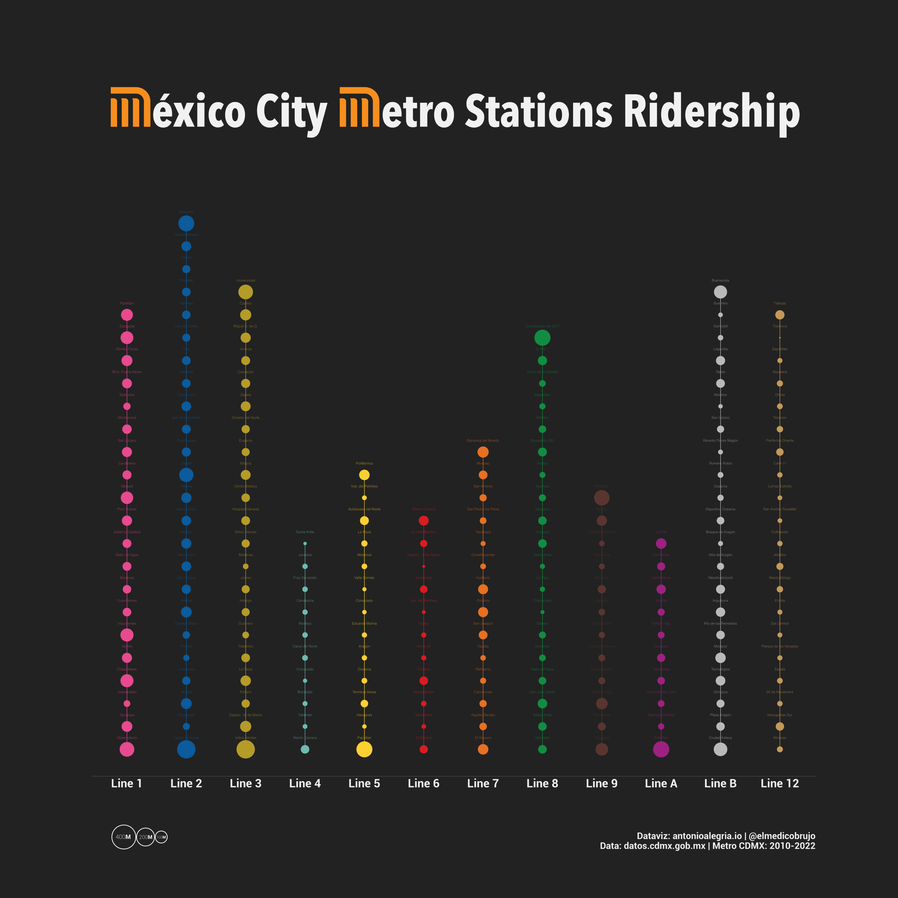

```{r setup, include=FALSE}
knitr::opts_chunk$set(echo = TRUE,
                      warning = FALSE,
                      message = FALSE,
                      eval = FALSE)

```

## Metro Ridership 




The Mexico City subway is not only one of the busiest metro systems in the world, but also a vibrant cultural hub that showcases colorful murals, live music performances, and a diverse array of street art.

Despite Mexico City's stark socioeconomic disparities, the subway serves as an equalizer, transporting over 1.6 billion passengers annually across the city, from the most affluent neighborhoods to the poorest areas.


To capture the full scope of twelve years' worth of ridership data in a single plot, follow these simple steps and unleash the power of {ggplot2}


1. Import the dataset.
2. Correct any factor issues that may exist in the data (and count).
3. Create a custom function for plotting.
4. Add plot aesthetics to make the plot more visually appealing.


### 1. Import the dataset

Here you can download the complete data.  [datos.cdmx.gob.mx](https://datos.cdmx.gob.mx/dataset/afluencia-diaria-del-metro-cdmx). 


Next, set up the necessary libraries for data wrangling and plotting using the tidyverse, as well as some additional packages for graphical enhancements:

```{r}
#libraries
pacman::p_load(readr,
               dplyr,
               tidyr,
               lubridate,
               forcats,
               ggplot2,
               scales
)


# Some additional customizations to the global theme.
theme_set(theme_minimal(base_size = 15))
theme_update(
  plot.title.position = "plot",
  axis.line.x = element_line(size = .2, colour = "grey50"),
  axis.line.y = element_line(size = .5, colour = "grey50"),
  panel.grid = element_blank()
)
 

```

Due to the presence of Latin characters in the dataset, it's necessary to specify the imports as UTF-8 to ensure proper encoding.

```{r}
df_simple_encoding <- read.csv("afluenciastc_simple_12_2022.csv", fileEncoding="UTF-8")

# Tip: if you don't know the encoding of your data try this
# guess_encoding("data.csv", n_max=10000, threshold = 0.2)

```


### 2. Correct any factor issues that may exist in the data.

Wrangling operations to prepare the `df_simple_encoding` dataset for plotting the ridership of twelve years.

 - We need to rename certain stations with special characters in their names to their correct names.
 - The linea column is then recoded to replace certain values with their equivalent values for consistency.
 - The `count()` function is used to count the number of rides (afluencia) for each station (estaciones_renamed).

```{r}

afluencia_lineas <- df_simple_encoding %>% 
  group_by(linea) %>%  # dataset is grouped by the Metro lines
  mutate(estaciones_renamed = case_when(
    estacion == "Gómez Far\xfc\xbe\x99\x86\x94\xbcas" ~ "Gómez Farías",
    estacion == "Tasque" ~ "Tasqueña",
    .default = estacion
  )) %>% 
  mutate(linea=recode_factor(linea,
                             "Linea 1" = "Line 1",
                             "Linea 2" = "Line 2",
                             "Linea 3" = "Line 3", 
                             "Linea 4" = "Line 4",
                             "Linea 5" = "Line 5",
                             "Linea 6" = "Line 6",
                             "Linea 7" = "Line 7",
                             "Linea 8" = "Line 8",
                             "Linea 9" = "Line 9",
                             "Linea A" = "Line A",
                             "Linea B" = "Line B",
                             "Linea 12" = "Line 12")
  )  %>%
  mutate(linea=recode_factor(linea,
                             "Línea 1" = "Line 1",
                             "Línea 2" = "Line 2",
                             "Línea 3" = "Line 3", 
                             "Línea 4" = "Line 4",
                             "Línea 5" = "Line 5",
                             "Línea 6" = "Line 6",
                             "Línea 7" = "Line 7",
                             "Línea 8" = "Line 8",
                             "Línea 9" = "Line 9",
                             "Línea A" = "Line A",
                             "Línea B" = "Line B",
                             "Línea 12" = "Line 12")
  )  %>%
  count(estaciones_renamed, wt = afluencia) %>% #
  na.omit() 

```

Convert into a factor variable with specific levels. The `levels` argument specifies the desired order of the factor levels, with "Line 1" as the first level and "Line 12" as the last level. 

This code ensures that the linea factor levels are ordered as desired for the subsequent plotting step.

```{r}

afluencia_lineas$linea <- factor(afluencia_lineas$linea, 
                                 levels=c(
                                   "Line 1",
                                   "Line 2",
                                   "Line 3", 
                                   "Line 4",
                                   "Line 5",
                                   "Line 6",
                                   "Line 7",
                                   "Line 8",
                                   "Line 9",
                                   "Line A",
                                   "Line B",
                                   "Line 12")
                                 )

```

Next is the messiest and least elegant part of this:

For each Metro Line, we need a new variable that numbers the order of each station. There are going to be duplicates, which we are going to deal with later.

*Note:* Metro stations are ordered in the order in which they appear on the map.

```{r}

afluencia_lineas_orden <- afluencia_lineas %>% 
  mutate(linea1_order = case_when(
   estaciones_renamed ==  "Observatorio" ~ 1,
   estaciones_renamed ==  "Tacubaya" ~ 2,
   estaciones_renamed ==  "Juanacatlán" ~ 3,
   estaciones_renamed ==  "Chapultepec" ~ 4,
   estaciones_renamed ==  "Sevilla" ~ 5,
   estaciones_renamed ==  "Insurgentes" ~ 6,
   estaciones_renamed ==  "Cuauhtémoc" ~ 7,
   estaciones_renamed ==  "Balderas" ~ 8,
   estaciones_renamed ==  "Salto del Agua" ~ 9,
   estaciones_renamed ==  "Isabel la Católica" ~ 10,
   estaciones_renamed ==  "Pino Suárez" ~ 11,
   estaciones_renamed ==  "Merced" ~ 12,
   estaciones_renamed ==  "Candelaria" ~ 13,
   estaciones_renamed ==  "San Lázaro" ~ 14,
   estaciones_renamed ==  "Moctezuma" ~ 15,
   estaciones_renamed ==  "Balbuena" ~ 16,
   estaciones_renamed ==  "Blvd. Puerto Aéreo" ~ 17, 
   estaciones_renamed ==  "Gómez Farías" ~ 18,     
   estaciones_renamed ==  "Zaragoza" ~ 19, 
   estaciones_renamed ==  "Pantitlán" ~ 20)
    ) %>% 
  mutate(linea2_order = case_when(
    estaciones_renamed == "Cuatro Caminos" ~ 1,        
    estaciones_renamed ==  "Panteones" ~ 2, 
    estaciones_renamed ==  "Tacuba" ~ 3, 
    estaciones_renamed ==  "Cuitláhuac" ~ 4, 
    estaciones_renamed ==  "Popotla" ~ 5, 
    estaciones_renamed ==  "Colegio Militar" ~ 6, 
    estaciones_renamed ==  "Normal" ~ 7, 
    estaciones_renamed ==  "San Cosme" ~ 8, 
    estaciones_renamed ==  "Revolución" ~ 9, 
    estaciones_renamed ==  "Hidalgo" ~ 10, 
    estaciones_renamed ==  "Bellas Artes" ~ 11, 
    estaciones_renamed ==  "Allende" ~ 12, 
    estaciones_renamed ==  "Zócalo" ~ 13, 
    estaciones_renamed ==  "Pino Suárez" ~ 14, 
    estaciones_renamed ==  "San Antonio Abad" ~ 15, 
    estaciones_renamed ==  "Chabacano" ~ 16, 
    estaciones_renamed ==  "Viaducto" ~ 17, 
    estaciones_renamed ==  "Xola" ~ 18, 
    estaciones_renamed ==  "Villa de Cortés" ~ 19, 
    estaciones_renamed ==  "Nativitas" ~ 20,
    estaciones_renamed ==  "Portales" ~ 21, 
    estaciones_renamed ==  "Ermita" ~ 22,    
    estaciones_renamed ==  "General Anaya" ~ 23,    
    estaciones_renamed ==  "Tasqueña" ~ 24)
  )%>% 
  mutate(linea3_order = case_when(
    estaciones_renamed == "Indios Verdes" ~ 1,        
    estaciones_renamed ==  "Deptvo. 18 de Marzo" ~ 2, 
    estaciones_renamed ==  "Potrero" ~ 3, 
    estaciones_renamed ==  "La Raza" ~ 4, 
    estaciones_renamed ==  "Tlatelolco" ~ 5, 
    estaciones_renamed ==  "Guerrero" ~ 6, 
    estaciones_renamed ==  "Hidalgo" ~ 7, 
    estaciones_renamed ==  "Juárez" ~ 8, 
    estaciones_renamed ==  "Balderas" ~ 9, 
    estaciones_renamed ==  "Niños Héroes" ~ 10, 
    estaciones_renamed ==  "Hospital General" ~ 11, 
    estaciones_renamed ==  "Centro Médico" ~ 12, 
    estaciones_renamed ==  "Etiopía" ~ 13, 
    estaciones_renamed ==  "Eugenia" ~ 14, 
    estaciones_renamed ==  "División del Norte" ~ 15, 
    estaciones_renamed ==  "Zapata" ~ 16, 
    estaciones_renamed ==  "Coyoacán" ~ 17, 
    estaciones_renamed ==  "Viveros" ~ 18, 
    estaciones_renamed ==  "Miguel A. de Q." ~ 19, 
    estaciones_renamed ==  "Copilco" ~ 20,
    estaciones_renamed ==  "Universidad" ~ 21)
  )%>% 
  mutate(linea4_order = case_when(
    estaciones_renamed == "Martín Carrera" ~ 1,        
    estaciones_renamed ==  "Talismán" ~ 2, 
    estaciones_renamed ==  "Bondojito" ~ 3, 
    estaciones_renamed ==  "Consulado" ~ 4, 
    estaciones_renamed ==  "Canal del Norte" ~ 5, 
    estaciones_renamed ==  "Morelos" ~ 6, 
    estaciones_renamed ==  "Candelaria" ~ 7, 
    estaciones_renamed ==  "Fray Servando" ~ 8, 
    estaciones_renamed ==  "Jamaica" ~ 9, 
    estaciones_renamed ==  "Santa Anita" ~ 10)
  )%>% 
  mutate(linea5_order = case_when(
    estaciones_renamed == "Pantitlán" ~ 1,        
    estaciones_renamed ==  "Hangares" ~ 2, 
    estaciones_renamed ==  "Terminal Aérea" ~ 3, 
    estaciones_renamed ==  "Oceanía" ~ 4, 
    estaciones_renamed ==  "Aragón" ~ 5, 
    estaciones_renamed ==  "Eduardo Molina" ~ 6, 
    estaciones_renamed ==  "Consulado" ~ 7, 
    estaciones_renamed ==  "Valle Gómez" ~ 8, 
    estaciones_renamed ==  "Misterios" ~ 9, 
    estaciones_renamed ==  "La Raza" ~ 10, 
    estaciones_renamed ==  "Autobuses del Norte" ~ 11, 
    estaciones_renamed ==  "Inst. del Petróleo" ~ 12, 
    estaciones_renamed ==  "Politécnico" ~ 13)
  )%>% 
  mutate(linea6_order = case_when(
    estaciones_renamed == "El Rosario" ~ 1,        
    estaciones_renamed ==  "Tezozomoc" ~ 2, 
    estaciones_renamed ==  "Azcapotzalco" ~ 3, 
    estaciones_renamed ==  "Ferrería" ~ 4, 
    estaciones_renamed ==  "Norte 45" ~ 5, 
    estaciones_renamed ==  "Vallejo" ~ 6, 
    estaciones_renamed ==  "Inst. del Petróleo" ~ 7, 
    estaciones_renamed ==  "Lindavista" ~ 8, 
    estaciones_renamed ==  "Deptvo. 18 de Marzo" ~ 9, 
    estaciones_renamed ==  "La Villa-Basilica" ~ 10, 
    estaciones_renamed ==  "Martín Carrera" ~ 11)
  )%>% 
  mutate(linea7_order = case_when(
    estaciones_renamed == "El Rosario" ~ 1,        
    estaciones_renamed ==  "Aquiles Serdán" ~ 2, 
    estaciones_renamed ==  "Camarones" ~ 3, 
    estaciones_renamed ==  "Refinería" ~ 4, 
    estaciones_renamed ==  "Tacuba" ~ 5, 
    estaciones_renamed ==  "San Joaquín" ~ 6, 
    estaciones_renamed ==  "Polanco" ~ 7, 
    estaciones_renamed ==  "Auditorio" ~ 8, 
    estaciones_renamed ==  "Constituyentes" ~ 9, 
    estaciones_renamed ==  "Tacubaya" ~ 10, 
    estaciones_renamed ==  "San Pedro los Pinos" ~ 11, 
    estaciones_renamed ==  "San Antonio" ~ 12, 
    estaciones_renamed ==  "Mixcoac" ~ 13,
    estaciones_renamed ==  "Barranca del Muerto" ~ 14)
  )%>% 
  mutate(linea8_order = case_when(
    estaciones_renamed ==  "Garibaldi" ~ 1,
    estaciones_renamed ==  "Bellas Artes" ~ 2,
    estaciones_renamed ==  "San Juan Letrán" ~ 3,
    estaciones_renamed ==  "Salto del Agua" ~ 4,
    estaciones_renamed ==  "Doctores" ~ 5,
    estaciones_renamed ==  "Obrera" ~ 6,
    estaciones_renamed ==  "Chabacano" ~ 7,
    estaciones_renamed ==  "La Viga" ~ 8,
    estaciones_renamed ==  "Santa Anita" ~ 9,
    estaciones_renamed ==  "Coyuya" ~ 10,
    estaciones_renamed ==  "Iztacalco" ~ 11,
    estaciones_renamed ==  "Apatlaco" ~ 12,
    estaciones_renamed ==  "Aculco" ~ 13,
    estaciones_renamed ==  "Escuadrón 201" ~ 14,
    estaciones_renamed ==  "Atlalilco" ~ 15,
    estaciones_renamed ==  "Iztapalapa" ~ 16,
    estaciones_renamed ==  "Cerro de la Estrella" ~ 17, 
    estaciones_renamed ==  "U A M  I" ~ 18,     
    estaciones_renamed ==  "Constitución de 1917" ~ 19)
  )%>% 
  mutate(linea9_order = case_when(
    estaciones_renamed == "Tacubaya" ~ 1,        
    estaciones_renamed ==  "Patriotismo" ~ 2, 
    estaciones_renamed ==  "Chilpancingo" ~ 3, 
    estaciones_renamed ==  "Centro Médico" ~ 4, 
    estaciones_renamed ==  "Lázaro Cárdenas" ~ 5, 
    estaciones_renamed ==  "Chabacano" ~ 6, 
    estaciones_renamed ==  "Jamaica" ~ 7, 
    estaciones_renamed ==  "Mixiuhca" ~ 8, 
    estaciones_renamed ==  "Velódromo" ~ 9, 
    estaciones_renamed ==  "Ciudad Deportiva" ~ 10, 
    estaciones_renamed ==  "Puebla" ~ 11, 
    estaciones_renamed ==  "Pantitlán" ~ 12)
  ) %>% 
  mutate(lineaA_order = case_when(
    estaciones_renamed == "Pantitlán" ~ 1,        
    estaciones_renamed ==  "Agrícola Oriental" ~ 2, 
    estaciones_renamed ==  "Canal de San Juan" ~ 3, 
    estaciones_renamed ==  "Tepalcates" ~ 4, 
    estaciones_renamed ==  "Guelatao" ~ 5, 
    estaciones_renamed ==  "Peñón Viejo" ~ 6, 
    estaciones_renamed ==  "Acatitla" ~ 7, 
    estaciones_renamed ==  "Santa Marta" ~ 8, 
    estaciones_renamed ==  "Los Reyes" ~ 9, 
    estaciones_renamed ==  "La Paz" ~ 10)
  )%>% 
  mutate(lineaB_order = case_when(
    estaciones_renamed == "Ciudad Azteca" ~ 1,        
    estaciones_renamed ==  "Plaza Aragón" ~ 2, 
    estaciones_renamed ==  "Olímpica" ~ 3, 
    estaciones_renamed ==  "Tecnológico" ~ 4, #Tecnológico a Ecatepec en 2008.
    estaciones_renamed ==  "Múzquiz" ~ 5, 
    estaciones_renamed ==  "Río de los Remedios" ~ 6, 
    estaciones_renamed ==  "Impulsora" ~ 7, 
    estaciones_renamed ==  "Nezahualcóyotl" ~ 8, 
    estaciones_renamed ==  "Villa de Aragón" ~ 9, 
    estaciones_renamed ==  "Bosque de Aragón" ~ 10, 
    estaciones_renamed ==  "Deportivo Oceanía" ~ 11, 
    estaciones_renamed ==  "Oceanía" ~ 12, 
    estaciones_renamed ==  "Romero Rubio" ~ 13, 
    estaciones_renamed ==  "Ricardo Flores Magón" ~ 14, 
    estaciones_renamed ==  "San Lázaro" ~ 15, 
    estaciones_renamed ==  "Morelos" ~ 16, 
    estaciones_renamed ==  "Tepito" ~ 17, 
    estaciones_renamed ==  "Lagunilla" ~ 18, 
    estaciones_renamed ==  "Garibaldi" ~ 19, 
    estaciones_renamed ==  "Guerrero" ~ 20,
    estaciones_renamed ==  "Buenavista" ~ 21)
  )%>% 
  mutate(linea12_order = case_when(
    estaciones_renamed == "Mixcoac" ~ 1,        
    estaciones_renamed ==  "Insurgentes Sur" ~ 2, 
    estaciones_renamed ==  "20 de Noviembre" ~ 3, 
    estaciones_renamed ==  "Zapata" ~ 4, 
    estaciones_renamed ==  "Parque de los Venados" ~ 5, 
    estaciones_renamed ==  "Eje Central" ~ 6, 
    estaciones_renamed ==  "Ermita" ~ 7, 
    estaciones_renamed ==  "Mexicaltzingo" ~ 8, 
    estaciones_renamed ==  "Atlalilco" ~ 9, 
    estaciones_renamed ==  "Culhuacán" ~ 10, 
    estaciones_renamed ==  "San Andrés Tomatlán" ~ 11, 
    estaciones_renamed ==  "Lomas Estrella" ~ 12, 
    estaciones_renamed ==  "Calle 11" ~ 13, 
    estaciones_renamed ==  "Periférico Oriente" ~ 14, 
    estaciones_renamed ==  "Tezonco" ~ 15, 
    estaciones_renamed ==  "Olivos" ~ 16, 
    estaciones_renamed ==  "Nopalera" ~ 17, 
    estaciones_renamed ==  "Zapotitlán" ~ 18, 
    estaciones_renamed ==  "Tlaltenco" ~ 19, 
    estaciones_renamed ==  "Tláhuac" ~ 20)
  )

```

Duplicates occur because transfer stations have double entrances. However, this analysis considers only the registration of the line in question

Therefore, we need to eliminate duplicates in each of the new variables. 

(Again, this is not very elegant)

```{r}
afluencia_lineas_orden$linea1_order[afluencia_lineas_orden$linea != 'Line 1'] <- NA
afluencia_lineas_orden$linea2_order[afluencia_lineas_orden$linea != 'Line 2'] <- NA
afluencia_lineas_orden$linea3_order[afluencia_lineas_orden$linea != 'Line 3'] <- NA
afluencia_lineas_orden$linea4_order[afluencia_lineas_orden$linea != 'Line 4'] <- NA
afluencia_lineas_orden$linea5_order[afluencia_lineas_orden$linea != 'Line 5'] <- NA
afluencia_lineas_orden$linea6_order[afluencia_lineas_orden$linea != 'Line 6'] <- NA
afluencia_lineas_orden$linea7_order[afluencia_lineas_orden$linea != 'Line 7'] <- NA
afluencia_lineas_orden$linea8_order[afluencia_lineas_orden$linea != 'Line 8'] <- NA
afluencia_lineas_orden$linea9_order[afluencia_lineas_orden$linea != 'Line 9'] <- NA
afluencia_lineas_orden$lineaA_order[afluencia_lineas_orden$linea != 'Line A'] <- NA
afluencia_lineas_orden$lineaB_order[afluencia_lineas_orden$linea != 'Line B'] <- NA
afluencia_lineas_orden$linea12_order[afluencia_lineas_orden$linea != 'Line 12'] <- NA
 
```


### 3. Create a custom function for plotting.

To build the plot, a new layer needs to be created for each of the twelve Metro Lines variables. Each layer is composed of:

- `geom_point()`: is used to create the stations, and depending on the ridership, increase or decrease the size of them.
- `annotate`: is used to connect the points vertically.
- `geom_text()`: is used to name individual stations.


The parameters of this function are:
- `lineas()`: the numbering variables for the twelve lines
- `color()`: the hex code of the corresponding line
- `line_position()`: the position inside the plot where the segment should be placed
- `n_stations()`: the number of stations at which to end the segment.

```{r}

my_geom_and_text <- function(lineas, color, line_position, n_stations){
  list(
    ggplot2::geom_point(aes(x = linea, y = {{ lineas }}, size = n),
                        color = color,
                        show.legend = FALSE,
                        na.rm = TRUE),
    ggplot2::annotate(geom = "segment",
                      x = line_position,
                      xend = line_position,
                      y = 1,
                      yend = n_stations,
                      color = color),
    ggplot2::geom_text(aes(x = linea, 
                           y = {{ lineas }},
                           label = estaciones_renamed),
                       size = 3,
                       color = color, alpha = .5,
                       nudge_y = .51,
                       na.rm = TRUE)
    )
  
}
  
```

### 4. Add plot aesthetics to make the plot more visually appealing.

Finally, this code generates the final plot of the ridership of the different metro lines in México City. It uses the custom function `my_geom_and_text()` that creates a segment of the line and adds the stations and their names. The function is called for each of the twelve metro lines in the dataset, with different parameters that specify the line number, color, position within the plot, and number of stations. The `scale_size()` function is used to set the size of the stations according to their ridership.


The rest is just the `theme()` function to customize the appearance of the plot.


```{r}
p <-  afluencia_lineas_orden %>% 
  ggplot() +
  my_geom_and_text(lineas = linea2_order,color = "#0b5b9d",
                   line_position = 2, n_stations = 24)+
  my_geom_and_text(lineas = linea1_order, color = "#e74a8e",
                   line_position = 1, n_stations = 20)+
  my_geom_and_text(lineas = linea3_order, color = "#b59b28",
                   line_position = 3, n_stations = 21)+
  my_geom_and_text(lineas = linea4_order, color = "#6fbab1",
                   line_position = 4, n_stations = 10)+
  my_geom_and_text(lineas = linea5_order, color = "#fcd030",
                   line_position = 5, n_stations = 13)+
  my_geom_and_text(lineas = linea6_order, color = "#d81c22",
                   line_position = 6, n_stations = 11)+
  my_geom_and_text(lineas = linea7_order, color = "#e77022",
                   line_position = 7, n_stations = 14)+
  my_geom_and_text(lineas = linea8_order, color = "#128c41",
                   line_position = 8, n_stations = 19)+
  my_geom_and_text(lineas = linea9_order, color = "#5a352f",
                   line_position = 9, n_stations = 12)+
  my_geom_and_text(lineas = lineaA_order, color = "#9d2180",
                   line_position = 10, n_stations = 10)+
  my_geom_and_text(lineas = lineaB_order, color = "#bbb9b8",
                   line_position = 11, n_stations = 21)+
  my_geom_and_text(lineas = linea12_order, color = "#c3995a",
                   line_position = 12, n_stations = 20)+
  scale_size(range = c(1, 20))+
  labs(title = "México City  Metro Stations Ridership",
       x = "",
       y = "",
       caption = "Dataviz: antonioalegria.io | @elmedicobrujo
        Data: datos.cdmx.gob.mx | Metro CDMX: 2010-2022")+
  theme(axis.line.y = element_blank(),
        axis.text.y = element_blank(),
        axis.text.x = element_text(size = 28,
                                   color = "#f1f1f1"),
        plot.margin = margin(7,7,5,7, "cm"),
        plot.title = element_text(hjust = 0.7, size = 110,
                                  color = "#f1f1f1",
                                  family = "Avenir Next Condensed",
                                  face = "bold",
                                  margin = margin(1,1,4,1, "cm")
                                  ),
        plot.caption = element_text(color = "#f1f1f1",
                                    size = 22, 
                                    margin = margin(3,1,-1,1, "cm")),
        text = element_text(family = "Roboto", 
                            face = "bold",
                            color = "#f1f1f1")
        
  )

# ggsave("stations_final_final_ver_12.png",
#        plot = p,
#        width = 1200,
#        height = 1200,
#        units = "px",
#        scale = 10,
#        dpi = 400,
#        bg = "#222222"
#        )
# 
 
```

*Note*: Logos and legend were added in figma. 


